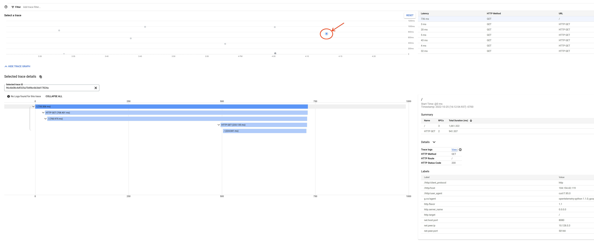

# cloud-trace-demo-app-opentelemetry

Open this demo app in [Google Cloud Shell](https://cloud.google.com/shell/docs/). This includes necessary tools.

We provide a public image for the services in this demo app. You could also build
your own following steps 4 - 6.

#### Demo Requirements
If you are using Cloud Shell, skip to the next section.

1. Install gcloud <https://cloud.google.com/sdk/install>
2. Install kubectl <https://kubernetes.io/docs/tasks/tools/install-kubectl/>
3. Install docker <https://docs.docker.com/install/>

    
#### Create a GKE cluster

8. Enable Google Cloud and set up region and zone.

    `gcloud init`
9. Enable the GKE API & billing:

    `gcloud services enable container.googleapis.com`
10. Create a GKE cluster named "demo":

    `gcloud container clusters create demo`

#### Send Requests to See Generated Traces

11. Build and tag the docker image for demo app:

    `docker build -t gcr.io/${PROJECT_ID}/demo:v1 .`
12. Create a Kubernetes Deployment for your `demo` Docker image.

    `kubectl create deployment demo --image=gcr.io/${PROJECT_ID}/demo:v1`
12. Send request to the service by using `curl` coupled with the service uri:

12. Visit [Trace List](https://console.cloud.google.com/traces/list) to check traces generated.
    Click on any trace in the graph to see the Waterfall View.
    
    
13. Clean up GKE cluster/pods/services:

    `gcloud container clusters delete demo`
